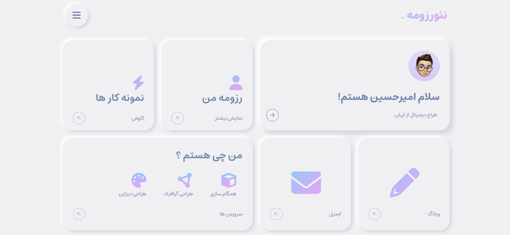

<h1 align="center"> Minifolio Website - Neo Resume </h1>  

  Mini Portfolio is A concise showcase of my skills and projects, highlighting my expertise in web design and development.

  

  

  

<!-- START doctoc generated TOC please keep comment here to allow auto update -->
<!-- DON'T EDIT THIS SECTION, INSTEAD RE-RUN doctoc TO UPDATE -->
## Table of Contents

- [Introduction](#introduction)
- [Features](#features)
- [Feedback](#feedback)
- [Contributors](#contributors)
- [Build Process](#build-process)
- [Backers](#backers-)
- [Sponsors](#sponsors-)
- [Acknowledgments](#acknowledgments)

<!-- END doctoc generated TOC please keep comment here to allow auto update -->

## Introduction

View repository and user information, control your notifications and even manage your issues and pull requests. Built with React Native, GitPoint is one of the most feature-rich unofficial GitHub clients that is 100% free.

## Features

A few of the things you can do with Minifolio:

* User friendly
* Responsive design
* Mobile first
* Apply labels and assignees
* Review and merge pull requests
* Create new issues
* Star, watch and fork repositories
* Control your unread and participating notifications
* Easily search for any user or repository

  

  

## Feedback

Feel free to send us feedback on [Twitter](https://twitter.com/Mashayekhi_AI) or [file an issue](https://github.com/MahdiMashayekhi-AI/Minifolio-Website/issues/new). Feature requests are always welcome. If you wish to contribute, please take a quick look at the [guidelines](./CONTRIBUTING.md)!

If there's anything you'd like to chat about, please feel free to join our [Gitter chat](https://gitter.im/MahdiMashayekhi-AI)!

## Contributors

This project follows the [contributors](https://github.com/MahdiMashayekhi-AI/Minifolio-Website/contrbutors.md) specification and is brought to you by these [awesome contributors](./CONTRIBUTORS.md).

## Build Process

- Follow the [TailwindCSS](https://tailwindcss.com/docs/installation) for getting started building a project with tailwindcss.
- Clone or download the repo[Minifolio-Website](https://github.com/MahdiMashayekhi-AI/Minifolio-Website.git)
- `node js` to install dependencies
- `npm install` to link dependencies

Please take a look at the [contributing guidelines](./CONTRIBUTING.md) for a detailed process on how to build your web app as well as troubleshooting information.

**Development Keys**: The `input.css` and `config.tailwind.js` in `root of project` are for development purposes and do not represent the actual application keys. Feel free to use them or use a new set of keys by creating an [OAuth application](https://github.com/settings/applications/new) of your own.

## Backers 

Thank you to all our backers! 🙏 [[Become a backer](https://opencollective.com/Minifolio-Website#backer)]

## Acknowledgments

Thanks to [JetBrains](https://www.jetbrains.com) for supporting us with a [free Open Source License](https://www.jetbrains.com/buy/opensource).
